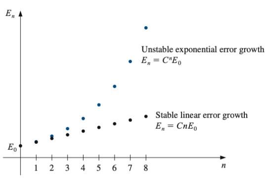

## What Are Round-Off Errors?

When you use a calculator or computer to do math, the results aren't always perfectly accurate. This happens because computers can't store infinite decimal places - they have to cut off numbers somewhere. The small errors that result from this limitation are called **round-off errors**.

Think of it like this: if you wanted to write down the exact value of 1/3, you'd need to write 0.333333... forever. But computers have limited memory, so they might store it as just 0.3333, creating a tiny error.

## How Computers Store Numbers

Computers store numbers in something called **floating-point form**. This is like scientific notation that you might remember from science class.

### The Standard Format

Numbers are stored in this pattern:
$$\pm 0.d_1d_2\ldots d_k \times 10^n$$

For example: 
- The number 1234.5 becomes $0.12345 \times 10^4$
- The number 0.00678 becomes $0.678 \times 10^{-2}$

### What Happens When Numbers Are Too Long?

When a number has more digits than the computer can store, it has to decide what to do with the extra digits. There are two main approaches:

**Chopping (Truncation)**: Simply cut off the extra digits
- Example: 0.123456789 with 4 digits becomes 0.1234

**Rounding**: Look at the next digit and round up if it's 5 or more
- Example: 0.123456789 with 4 digits becomes 0.1235 (because the 5th digit is 5)

## Measuring How Wrong We Are

When we approximate a number, we want to know how far off we are. There are two ways to measure this:

**Absolute Error**: The actual difference between the real value and our approximation
- If the real value is 10 and we approximate it as 9.8, the absolute error is |10 - 9.8| = 0.2

**Relative Error**: The error as a percentage of the real value
- Using the same example: relative error = |10 - 9.8|/10 = 0.02 = 2%

Relative error is often more useful because it tells you the error in context. An error of 0.2 is huge if you're measuring something that should be 1, but tiny if you're measuring something that should be 1000.

## Computer Arithmetic Isn't Perfect

When computers add, subtract, multiply, or divide, they're not doing exact math. They're doing approximate math with their stored approximations.

Here's what happens:
- Computer addition: Take two stored numbers, add them, then store the result (which might get rounded again)
- Computer subtraction: Same process but with subtraction
- And so on...

**Important insight**: You can sometimes get better results by rearranging your calculations. The order of operations can matter for accuracy!

## Truncation Errors and Taylor Series

**Truncation errors** happen when we use a simplified formula instead of the exact (but often impossible to compute) mathematical formula.

### Taylor Series: The Mathematical Swiss Army Knife

The Taylor series is one of the most powerful tools in numerical methods. It lets us approximate complicated functions using simple polynomials.

**The Big Idea**: Any smooth function can be approximated by a polynomial. The more terms you include, the better your approximation.

### Taylor's Theorem (Simplified)

For any function f(x), we can write:
$$f(x) = P_n(x) + R_n(x)$$

Where:
- $P_n(x)$ is our polynomial approximation (the part we can easily calculate)
- $R_n(x)$ is the error term (how wrong our approximation is)

The polynomial looks like:
$$P_n(x) = f(x_0) + f'(x_0)(x-x_0) + \frac{f''(x_0)}{2!}(x-x_0)^2 + \frac{f'''(x_0)}{3!}(x-x_0)^3 + \ldots$$

**In plain English**: Start with the function value at one point, then add corrections based on how fast the function is changing (the derivatives).

### Example: Approximating $e^x$

Let's say we want to approximate $e^{0.5}$ (which is about 1.649).

For $f(x) = e^x$ around $x_0 = 0$:
- $f(0) = 1$
- $f'(0) = 1$ (derivative of $e^x$ is $e^x$)
- $f''(0) = 1$
- And so on...

So our approximation becomes:
$$e^x \approx 1 + x + \frac{x^2}{2!} + \frac{x^3}{3!} + \frac{x^4}{4!} + \ldots$$

For $x = 0.5$:
$$e^{0.5} \approx 1 + 0.5 + \frac{(0.5)^2}{2} + \frac{(0.5)^3}{6} + \frac{(0.5)^4}{24} + \ldots$$

## Algorithms and Stability

### What Makes a Good Algorithm?

An **algorithm** is just a step-by-step recipe for solving a problem. But not all algorithms are created equal.

**Stable algorithms**: Small errors in the input lead to small errors in the output. These are good!

**Unstable algorithms**: Small errors in the input can lead to huge errors in the output. These are dangerous!

**Conditionally stable**: Sometimes stable, sometimes not - depends on the specific numbers you're working with.

### How Errors Grow

Imagine you start with a small error and perform many calculations. How does that error grow?

**Linear growth**: Error grows steadily
- After n steps: Error ≈ C × n × (original error)
- This is manageable

**Exponential growth**: Error explodes
- After n steps: Error ≈ $C^n$ × (original error)  
- This is dangerous! Even tiny initial errors become huge

### Rate of Convergence

When we use iterative methods (doing the same calculation over and over to get closer to the answer), we want to know how fast we're approaching the correct answer.

**Big O notation** tells us this: if we say something converges as $O(h^2)$, it means when we halve the step size h, our error gets 4 times smaller. The higher the power, the faster the convergence.

---

## Key Takeaways

1. **Computers aren't perfect calculators** - they make small errors due to limited precision
2. **Order of operations matters** - rearranging calculations can improve accuracy  
3. **Taylor series let us approximate complex functions** with simple polynomials
4. **Stable algorithms are crucial** - small errors shouldn't become big problems
5. **Understanding error growth helps us** choose better methods