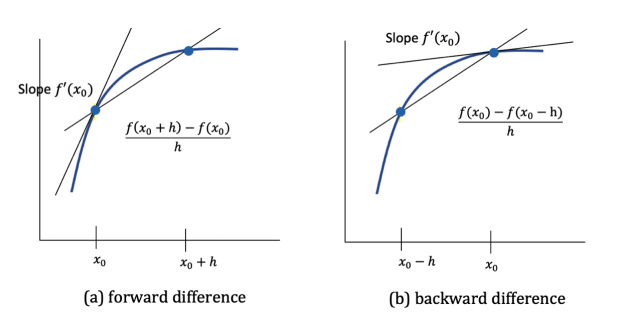
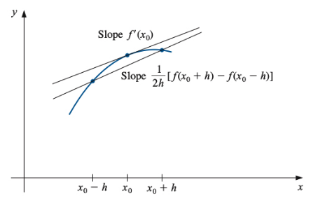
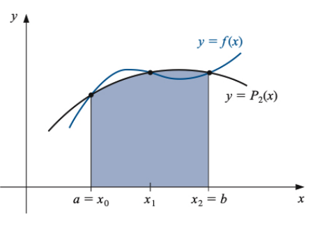
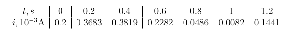

## What Are These Methods and Why Do We Need Them?

In math and engineering, we often need to find slopes (derivatives) and areas under curves (integrals). Sometimes the math is too complicated to do by hand, or we only have data points instead of exact equations. That's where numerical methods come in - they give us good approximations using simple calculations.

**Think of it like this:**
- **Numerical differentiation** = Finding the slope when you can't use calculus rules
- **numerical integration** = Finding the area under a curve when you can't integrate normally

---

# Part 1: Finding Slopes (Numerical Differentiation)

## The Basic Idea: What is a Derivative Really?

A derivative is just the slope of a curve at a point. Remember from basic calculus:

$$\text{slope} = \frac{\text{rise}}{\text{run}} = \frac{\text{change in y}}{\text{change in x}}$$

For a function, this becomes: $f'(x) = \frac{f(x+h) - f(x)}{h}$ when $h$ is very small.

## Three Ways to Approximate Slopes

### Method 1: Forward Difference - "Look Ahead"

**The idea**: Use the current point and the next point to estimate slope.

$$f'(x) \approx \frac{f(x + h) - f(x)}{h}$$

**Think of it as**: If you're walking up a hill, look at where you are now and where you'll be after one step forward.

**Example**: If you want the slope at $x = 2$, use points at $x = 2$ and $x = 2.1$ (if $h = 0.1$).

### Method 2: Backward Difference - "Look Behind"

**The idea**: Use the previous point and the current point.

$$f'(x) \approx \frac{f(x) - f(x - h)}{h}$$

**Think of it as**: Look at where you just came from and where you are now.

**Example**: For slope at $x = 2$, use points at $x = 1.9$ and $x = 2$.

### Method 3: Centered Difference - "Look Both Ways"

**The idea**: Use points on both sides of where you want the slope.

$$f'(x) \approx \frac{f(x + h) - f(x - h)}{2h}$$

**Why this is better**: It's like getting a second opinion - you look both ways and average out the errors!

**Example**: For slope at $x = 2$, use points at $x = 1.9$ and $x = 2.1$.

## **Which Method Should You Use?**

**Always use centered difference when possible!** Here's why:
- Forward/backward difference: errors decrease like $h$ (if you halve the step size, error halves)
- Centered difference: errors decrease like $h^2$ (if you halve the step size, error becomes 1/4!)

## Finding Second Derivatives (Acceleration, Curvature)

Sometimes you need the derivative of the derivative. The most common formula is:

$$f''(x) \approx \frac{f(x + h) - 2f(x) + f(x - h)}{h^2}$$

**What this means**: It measures how much the slope is changing.

## Making It Even More Accurate

If you need super-high accuracy, you can use more points:

$$f'(x) = \frac{1}{h}\left[-\frac{3}{2}f(x) + 2f(x + h) - \frac{1}{2}f(x + 2h)\right]$$

This uses three points and is much more accurate than the basic forward difference.

---

### **Practice Problem: Normal Distribution**
For the bell curve $f(x) = \frac{1}{\sqrt{2\pi}} e^{-x^2/2}$, find the derivative at several points using $h = 0.2$.

Try all three methods and see how centered difference gives the best results!

### **Real-World Example: Tracking a Plane**
Radar gives you position data every second. To find velocity and acceleration, you need to take derivatives of position data using these formulas.

---

# Part 2: Finding Areas Under Curves (Numerical Integration)

## The Basic Idea: What is Integration Really?

Integration finds the area under a curve. When we can't integrate by hand, we approximate the curved area using simple shapes like rectangles or triangles.

## Method 1: Trapezoidal Rule - "Connect the Dots"

**The idea**: Connect your data points with straight lines and find the area of the resulting trapezoids.

$$\int_a^b f(x)dx \approx \frac{h}{2}[f(a) + f(b)]$$

where $h = b - a$.

**Visual**: Imagine the area under the curve as a trapezoid. The area = width × average height.

**Easy to remember**: Just average the two heights and multiply by the width!

## Method 2: Simpson's Rule - "Use Curved Lines"

**The idea**: Instead of straight lines, fit parabolas (curved lines) through your points. This captures curves much better!

$$\int_a^b f(x)dx \approx \frac{h}{3}[f(a) + 4f(\text{middle}) + f(b)]$$

where the middle point is at $\frac{a+b}{2}$ and $h = \frac{b-a}{2}$.

**The magic 1-4-1 pattern**: Notice the coefficients are 1, 4, 1. This is the key to Simpson's rule!

**Why is this better?** Parabolas fit curves much better than straight lines, so you get way more accuracy.

## Method 3: Simpson's 3/8 Rule - "For Four Points"

When you have four points, you can use:

$$\int_a^b f(x)dx = \frac{3h}{8}[f(x_0) + 3f(x_1) + 3f(x_2) + f(x_3)]$$

**The pattern**: 1-3-3-1 coefficients. Use this when you can't apply the regular Simpson's rule.

---

### **Practice Problem: Bell Curve Probability**
Find the probability that a normally distributed value falls within one standard deviation of the mean. This requires integrating the bell curve!

---

## Handling Larger Intervals: Composite Methods

### The Problem
These basic rules only work well on small intervals. For larger intervals, the approximation gets worse.

### The Solution: Divide and Conquer!

**Composite Trapezoidal Rule**:
1. Divide your interval into many small pieces
2. Apply the trapezoidal rule to each piece
3. Add up all the areas

$$\int_a^b f(x)dx \approx \frac{h}{2}\left[f(x_0) + 2\sum_{i=1}^{n-1} f(x_i) + f(x_n)\right]$$

**Easy pattern to remember**:
- First and last points: multiply by 1
- All middle points: multiply by 2
- Then multiply everything by $\frac{h}{2}$

**Composite Simpson's Rule**:
Similar idea, but you need an even number of intervals:

$$\int_a^b f(x)dx = \frac{h}{3}\left[f(x_0) + 2\sum_{\text{even}} f(x_i) + 4\sum_{\text{odd}} f(x_i) + f(x_n)\right]$$

**The pattern**:
- Endpoints: coefficient 1
- Even-indexed middle points: coefficient 2
- Odd-indexed middle points: coefficient 4
- Multiply by $\frac{h}{3}$

---

### **Real-World Example: Capacitor Charging**
A capacitor's voltage depends on the integral of current over time: $V(t) = \frac{1}{C}\int_0^t i(t)dt$

Given current measurements every 0.2 seconds, use numerical integration to find how voltage changes.

---

# Quick Reference Guide

## **For Finding Slopes (Derivatives)**

**Most accurate formula:**
$$f'(x) \approx \frac{f(x + h) - f(x - h)}{2h}$$

**For second derivatives:**
$$f''(x) \approx \frac{f(x + h) - 2f(x) + f(x - h)}{h^2}$$

## **For Finding Areas (Integrals)**

**Quick and easy (Trapezoidal):**
$$\int_a^b f(x)dx \approx \frac{h}{2}[f(a) + f(b)]$$

**More accurate (Simpson's):**
$$\int_a^b f(x)dx \approx \frac{h}{3}[f(a) + 4f(\text{middle}) + f(b)]$$

**For larger intervals:** Use composite methods (divide the interval into smaller pieces)

## **Pro Tips**

1. **Smaller step size $h$** usually means better accuracy
2. **Centered methods** are almost always more accurate than forward/backward
3. **Simpson's rule** is usually much better than trapezoidal for integration
4. **When in doubt**, try different step sizes and see if your answer stabilizes

## **Common Mistakes to Avoid**

- Don't forget to divide by $2h$ (not $h$) in centered difference
- In Simpson's rule, make sure your middle point is exactly halfway
- For composite methods, keep track of your coefficients (1-2-2-...-2-1 for trapezoidal, 1-4-2-4-...-4-1 for Simpson's)
- Always check: does your answer make sense?