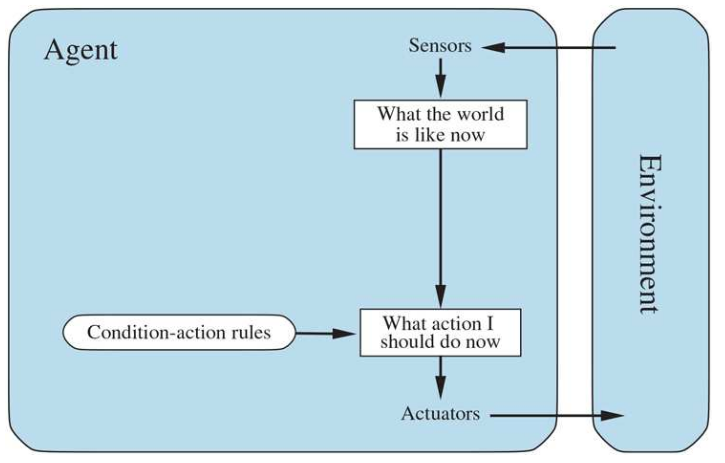
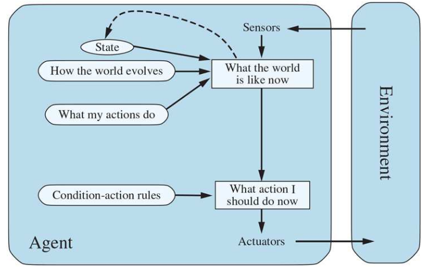
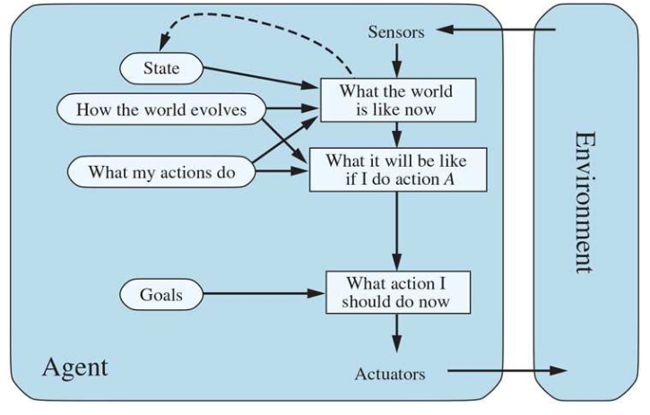
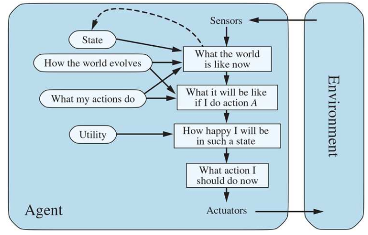
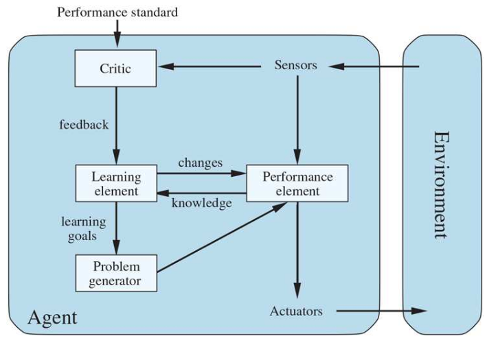
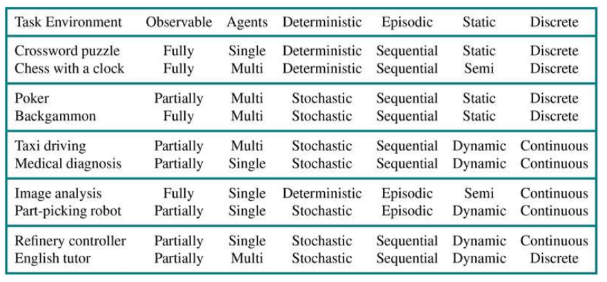

## How agents should Act
An **agent** is anything that can be viewed as **perceiving** it's environment through **sensors** and **acting** upon that environment through **effectors.**
### Rational Agent
An agent that does the right thing given what has been perceived.

What is the right thing?
- The thing that will cause the agent to be most successful.
How to measure success?
- We use **performance measure**. 
	Ex:
	- How fast the agent is
	- How accurate it is
### Omniscience
Omniscient agent knows the actual outcome of its actions, and can act accordingly.

### What is rational at any given time depends on :
- Performance measure that defines degree of success
- Everything an agent has perceived so far (**percept sequence**)
- What the agent knows about the environment
- The actions that agent can perform.

### Ideal Rational Agent
For each possible precept sequence, an ideal rational agent should do whatever action is expected to maximize its performance measure, on the basis of the evince provided by the precept sequence and whatever build tin knowledge the agent has

### Ideal Mapping
Specifying which action an agent ought to take in response to any given precept sequence provides a design for an ideal agent

## Structure of Intelligent Agents
### Agent Program
A function that implement agent mapping from precepts to actions.

### Types of Agents
- Simple reflex agents
- Agents that keep track of the world
- Goal based agents
- Utility based agents
#### Simple reflex agents

Uses **condition-action rules**. Works by finding a rule whose condition matches the current situation, and doing the action associated with that rule
ex: **if** car infront is braking **then** initiate braking

#### Agents that keep track of the world (Model based agent)

Maintains some sort of internal state.
Most of the time this internal state is the previous input from the precept.

#### Goal based agents

The agent needs some sort of **goal** information, agent chooses its actions that achieve the goal.
**Search** and **Planning** are two ways to find action sequences that achieve the agents goals.
#### Utility Based agents

Goals alone are not enough to generate high-quality behavior.
Utility based approach allows comparison between different world states
If one world state is preferred over another, then it has higher utility for the agent.
Utility is a function that maps a state into a real number, which descibes the associated degree of happiness.
#### Learning agents

Any type of agent can be built as a learning agent. Allows the agent to operate in initially unknown environments and to become more competent than its initial knowledge alone might allow.

## Environments

### Properties of environments
#### Fully Observable VS. Partially Observable
If the agent's sensory apparatus gives it full access to the environment, then that environment is Fully Observable
#### Single agent vs Multi agent
There are two types of multi agent environments, **cooperative** and **competitive**
#### Deterministic vs Nondeterministic
If next state of the environment is completely determined by the actions selected by the agents, then that environment is deterministic.
Agents doesn't need to worry about uncertainty in deterministic environments
#### Episodic vs Nonepisodic (Sequential)
In episodic environment. the agent's experience is divided into episodes. each episodes consists of agent perceiving and then acting. Quality of action depends on the episode itself. Subsequent episodes do not depend on what actions occur in previous episodes.
#### Static vs Dynamic
Environment is dynamic if it can change while an agent is deliberating.
If the environment doesn't change with time, but the agent's performance score does, then we say the environment is **semi-dynamic**
#### Discrete vs Continuous
If there are a limited number of distinct, clearly defined precepts and actions, we say that the environment is discrete.

