Combinational logic circuits produce outputs based **only on current inputs**. They do not have memory.

---

## 📦 1. Decoder

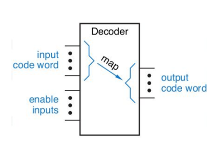

- Converts binary input into maximum of m = 2n or less  unique output lines.
- Common types: 2-to-4, 3-to-8 decoders.
- Example: Used in memory address decoding.

### 🔢 2-to-4 Decoder 
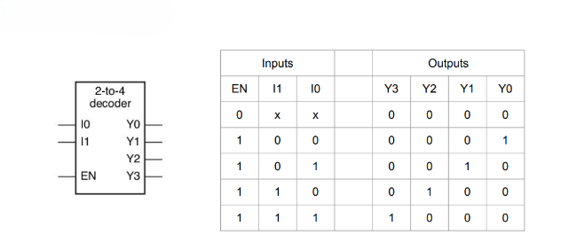
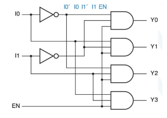

### 🔢 3-to-8 Decoder 

### Decoder expansion
- Each minterm → one AND gate
- Large decoders → need many-input ANDs (not practical)
- Use small decoders → build big decoder (hierarchical)
- Final AND gates → only 2 inputs
- ANDs implement minterms

Example:-

 

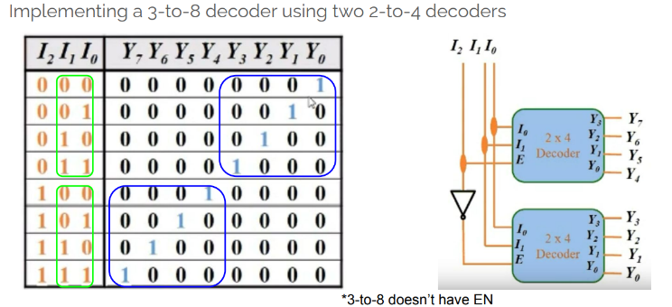
### Implementing logic functions using a decoder

---

## 🎙️ 2. Encoder

Opposite of Decoding:
- m-bit input → n-bit output (n ≤ m ≤ 2ⁿ)
- Input: one-hot (only one 1)

### 4-to-2 encoder

### 8-to-3 line encoder (octal-to-binary encoder)
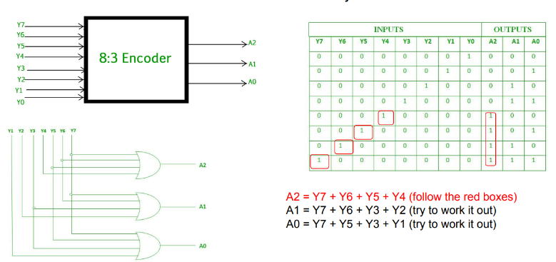
### Decimal to BCD encoder
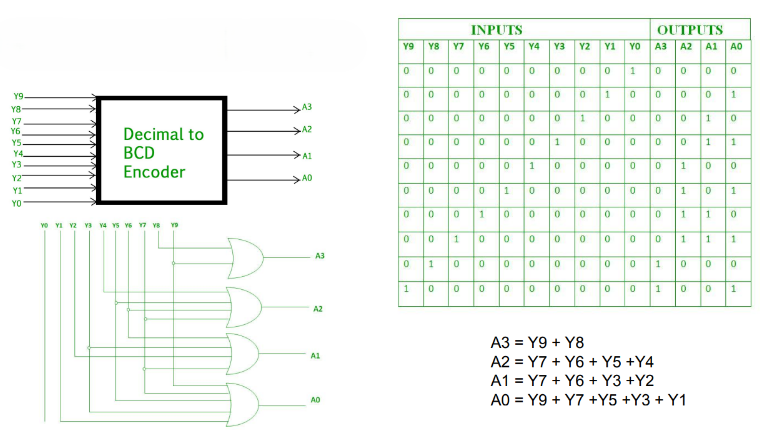
### Priority encoder

### Example application:
- Positional encoder
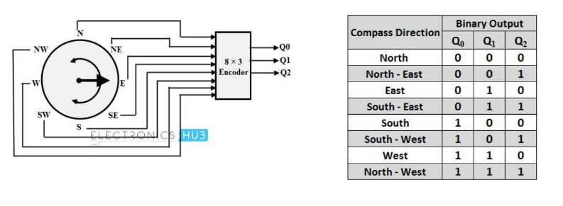

---

## 🔀 3. Multiplexer (MUX)

- Selects one of many input lines and forwards it to a single output.
- Controlled using select lines.

### 2 input MUX
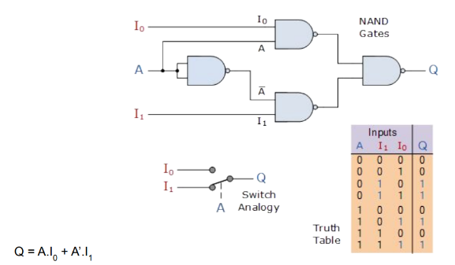

### 4-to-1 MUX

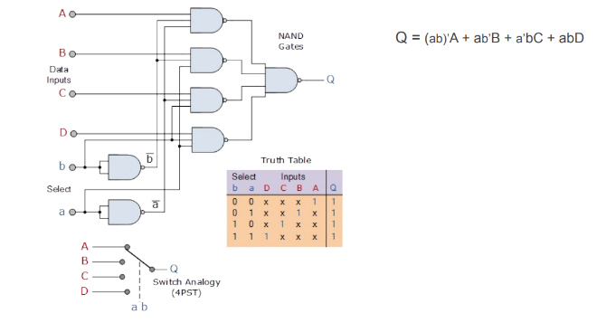

### Difference between Multiplexer, Decoder, and Encoder

| Feature            | Multiplexer (MUX)                 | Decoder                          | Encoder                           |
|--------------------|-----------------------------------|----------------------------------|-----------------------------------|
| Purpose            | Selects one input to pass to output | Converts binary input to 1-hot output | Converts 1-hot input to binary output |
| Inputs             | Multiple data inputs, select lines | n input lines                    | 2ⁿ input lines                    |
| Outputs            | Single output                     | 2ⁿ output lines                  | n output lines                    |
| Control Signals    | Select lines                      | Input acts as select             | No select; active input only      |
| Direction          | Many → 1                          | n → 2ⁿ                           | 2ⁿ → n                            |
| Example Use        | Data routing                      | Address decoding                 | Priority coding                   |

---

## 🧰 4. Digital Buffers

### Single input digital buffer

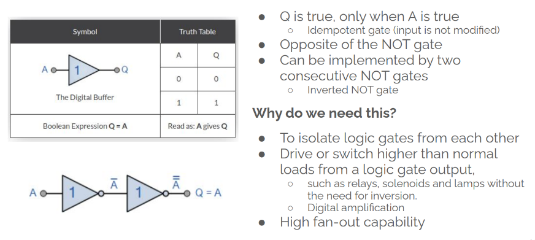

### Three state (Tri State buffer)

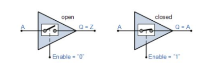

Tri-state Buffer:
- 2 logic levels (0,1), 3 output levels (0,1, High-Z)
- EN=0 → High-Z (acts like open circuit)
- Used to isolate output from bus
- Allows multiple devices to share same bus
- Common in data buses (e.g., computer peripherals)

### Tri-state Digital Buffer Data Bus Control

### Tri-state Digital Buffer Control

- allowing only one set of data to pass either a logic “1” or logic “0” output 
state onto the bus
- all the other tri-state outputs connected to the same bus lines are disabled 
by being placed in their high impedance Hi-Z state.

There are four types of tri-state buffers:
- 1. Active High tri-state buffer
- 2. Active high inverting tri-state buffer
- 3. Active Low tri-state buffer
- 4. Active low inverting tri-state buffer

#### Tri-state buffer - active high variants

#### Tri-state buffer - active low variants
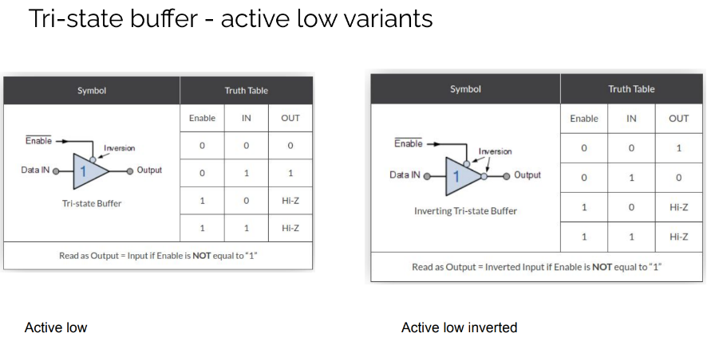
---

## ⚖️ 5. Comparator

- Compares two binary numbers.

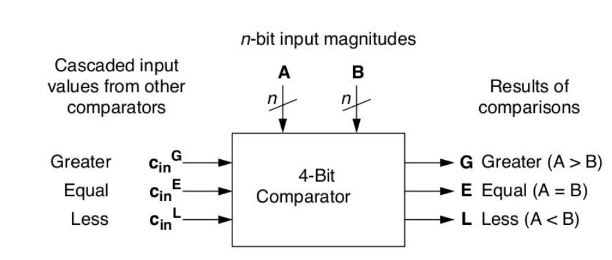

### Types of Comparators

1. **Equality Comparator**
   - Single output
   - Output HIGH if A = B, else LOW

2. **Magnitude Comparator**
   - Three outputs:
     - A < B
     - A = B
     - A > B

#### 1-bit magnitude comparator
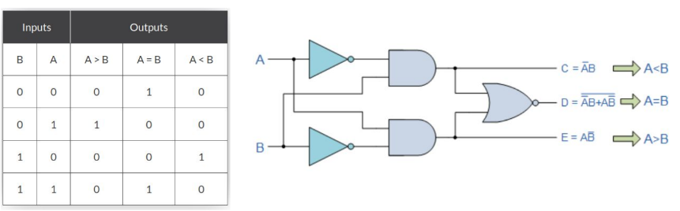

#### 2-bit magnitude comparator
1. Designing 

2. Realizing
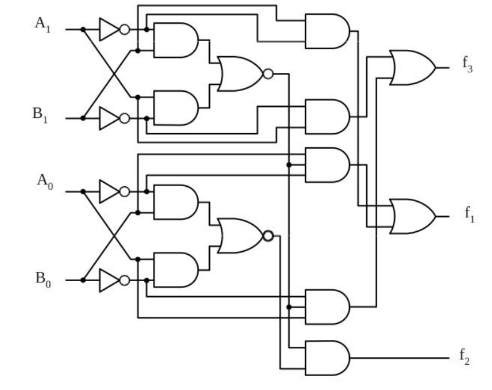

#### N-bit magnitude comparator

## ➕➖ 6. Adders, Subtractors, and ALUs

### ➕ Adders:

- Do binary addition
- Inputs: two or more binary numbers
- Outputs: SUM and CARRY (Cout)

#### Half Adder: Adds two bits.

#### Full Adder: Adds three bits (including carry-in).

-  Has an additional input bit C in to represent a carry-in bit coming from a 
previous addition step

#### Full adder implementation with half adders

#### Ripple Carry Adder

- Uses n full adders connected in series
- Carry ripples from LSB to MSB (right to left)

##### 4-bit ripple carry adder

- **Disadvantage:** output will not be valid until any carry-input has “rippled” through every full adder in 
the chain

#### Carry Lookahead Adder (CLA)
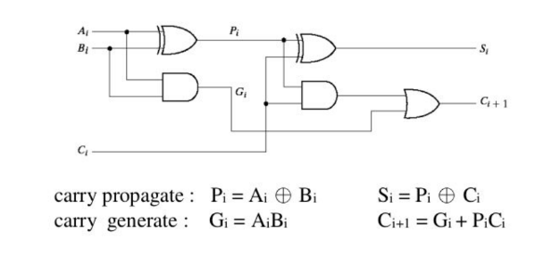

- Speeds up addition by computing carries in parallel
- No need to wait for ripple from LSB to MSB
- At each bit:
  1. Generate carry (from xi and yi)
  2. Propagate carry (pass carry-in to carry-out)

- 3 levels of delay:
  1. Generate & propagate signals
  2. Carry lookahead (sum-of-products)
- Faster than ripple carry due to parallel carry logic
### ➖ Subtractors:
- A – B = A + 2’s complement of B
- 2’s complement: B’ + 1
- Circuit: Adder + inverters on B inputs
- Set input carry C0 = 1

#### 4-bit Adder-Subtractor

#### Overflow:
- Happens when result > range of bits
- Common in signed binary addition/subtraction
- Detected when:
  - Two positives → negative result
  - Two negatives → positive result
- **Example** 

### 🧮 ALUs (Arithmetic Logic Units):
- Perform arithmetic and logical operations.
- Core component of a CPU.

- Basic ALU Architecture

---

## 🧾 7. Lookup Tables (LUTs)

- Memory-based way to implement logic
- Store outputs for all input combinations
- Inputs = address, output = stored value
- No need for logic gates
- Can be cascaded for complex functions

#### Half adder using LUTs
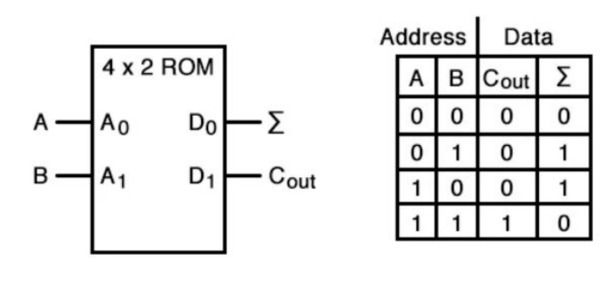

#### Multiplexers as LUTs

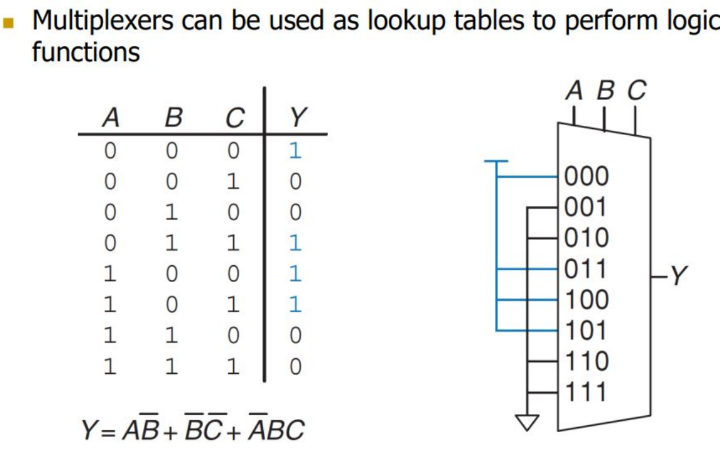

#### Uses of LUTs:
1. PLDs: Used in FPGAs/CPLDs to build custom logic
2. Speed: Precomputed outputs → faster than gate-based logic
3. Simplifies complex functions → fewer gates
4. Function approximation → for math/nonlinear functions

---
