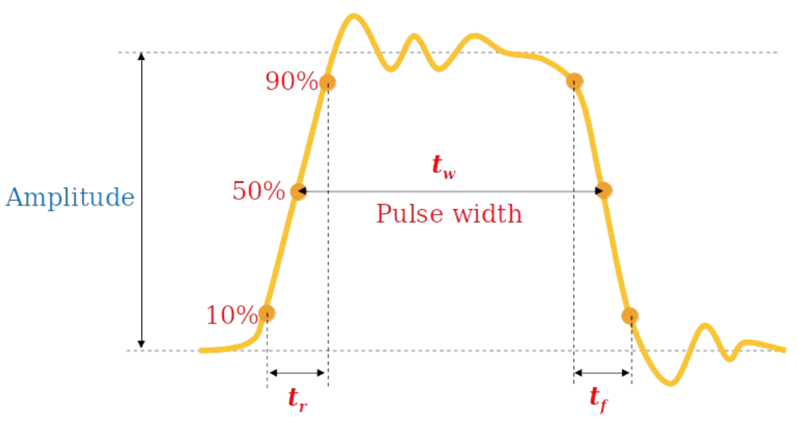
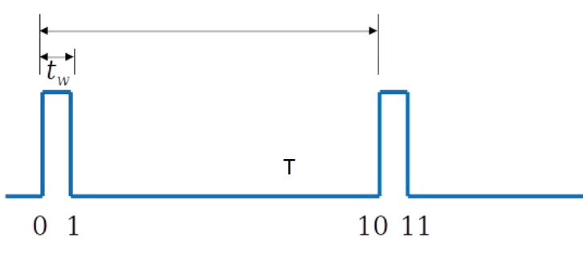

## Advantages of Digital
- Reproducibility of results
- Ease of Design
- Flexibility
- Programmability
- Speed
## Logic Levels
- **Ideally :** HIGH(1) and LOW(0)
- **Practically :** *In CMOS*
	- HIGH: 2V - 3.3V
	- LOW: 0V - 0.8V
## Digital Waveforms

### Non-ideal Pulse

### Duty Cycle
$$
Duty\ Cycle = \frac{t_w}{T} \times 100\%
$$

## Digital Logic Families

Collection of different integrated circuit chips that have:
- Similar input, output and internal circuit characteristics
- Methods to implement all necessary logic functions

> Chips from the same family can be interconnected to perform any desired logic function

> Chips from different logic families may not be compatible

### Electrical behavior of Logic Families
- Logic Voltage level
- **DC noise margins :** 
	  Highest `LOW` voltage of an output must be always lower than the highest voltage that an output can reliably interpret as `LOW`
- **Fanout :**
		Number of inputs connected to a given output
- Speed
- Power Consumption
- Noise / Interference : Cosmic Rays
- Electrostatic discharge

## Binary Data transfer
- **Serial :** Send one bit at a time
- **Parallel :** All bits in a group are sent out on separate lines at the same time
- **Serial vs Parallel:**
	  Serial use less transmission lines
	  Takes more time to transfer
