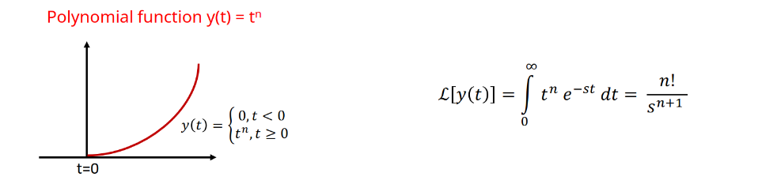
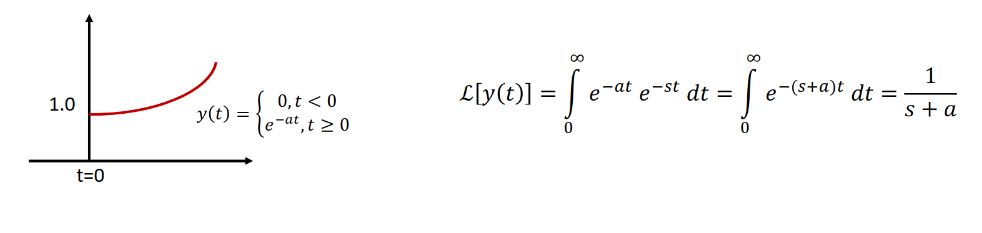
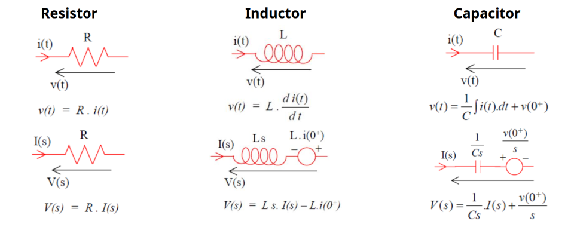

> *"What we know is not much, what we do not know is immense."*  
> — Pierre-Simon Laplace

## Introduction

The Laplace transformation is a mathematical tool that converts functions from the time domain to the complex frequency domain. This method can convert differential equations into simpler algebraic equations, making circuit analysis more manageable.

### Definition

The Laplace transform is defined as:

$$ \mathcal{L}\{f(t)\} = F(s) = \int_0^\infty f(t) \cdot e^{-st} \, dt $$

Where:
- $f(t)$ is the original time domain function
- $F(s)$ is the transformed function in the s-domain
- $s = \sigma + j\omega$ (complex frequency variable)

This method works because $e^{-st}$ acts as a "weighting function" that extracts frequency information from $f(t)$. The weighting function multiplies different parts of our original function by different amounts, emphasizing some parts less and some parts more.

**Important Note:** This transformation is only defined for causal functions, where:
- $f(t) = 0$ for all $t < 0$
- $f(t)$ can be anything for $t \geq 0$

## Laplace Inverse Transformation

The Laplace inverse transform is defined as:

$$ f(t) = \frac{1}{2\pi j} \int_{\sigma-j\infty}^{\sigma+j\infty} F(s) \cdot e^{st} \, ds $$

However, we don't need to calculate in this manner. Instead, we generally obtain the inverse transform from tables that provide 's' to 't' conversions.

## System Analysis

In system analysis, the output in the s-domain is obtained by multiplying the transfer function and input function:

$$ Y(s) = F(s) \cdot U(s) $$

Where:
- $Y(s)$ = Output (response) function
- $F(s)$ = Transfer function
- $U(s)$ = Input (excitation) function

## Properties of Laplace Transform

### 1. Linearity
**Forward Transform:**

$$ \mathcal{L}\{af_1(t) + bf_2(t)\} = aF_1(s) + bF_2(s) $$

**Inverse Transform:**

$$ \mathcal{L}^{-1}\{aF_1(s) + bF_2(s)\} = af_1(t) + bf_2(t) $$

### 2. Differentiation Property
**First derivative:**

$$ \mathcal{L}\{df(t)/dt\} = s \cdot F(s) - f(0^+) $$

**Second derivative:**

$$ \mathcal{L}\{d^2f(t)/dt^2\} = s^2 \cdot F(s) - s \cdot f(0^+) - f'(0^+) $$

**General nth derivative:**

$$ \mathcal{L}\{d^nf(t)/dt^n\} = s^nF(s) - s^{n-1}f(0^+) - s^{n-2}f'(0^+) - \ldots - f^{(n-1)}(0^+) $$

### 3. Integration Property

$$ \mathcal{L}\{\int_0^t f(t)\,dt\} = \frac{F(s)}{s} $$

### 4. Value Theorems
**Initial Value Theorem:**

$$ f(0^+) = \lim_{t \to 0^+} f(t) = \lim_{s \to \infty} s \cdot F(s) $$

**Final Value Theorem:**

$$ f(\infty) = \lim_{t \to \infty} f(t) = \lim_{s \to 0} s \cdot F(s) $$

### 5. Scaling Properties
**Time Scaling:**

$$ \mathcal{L}\{f(t/a)\} = a \cdot F(as) $$

**Frequency Scaling:**

$$ \mathcal{L}^{-1}\{F(s/a)\} = a \cdot f(at) $$

### 6. Multiplication by $t^n$

$$ \mathcal{L}\{t^n \cdot f(t)\} = (-1)^n \cdot \frac{d^nF(s)}{ds^n} $$

### 7. Time Delay

$$ \mathcal{L}\{f(t-T)\} = e^{-sT} \cdot F(s) $$

### 8. Translation in s

$$ \mathcal{L}^{-1}\{F(s+a)\} = e^{-at} \cdot f(t) $$

## Common Excitation Functions

### Unit Impulse Function $\delta(t)$

- **Laplace Transform:** 

$$ \mathcal{L}\{\delta(t)\} = 1 $$

### Unit Step Function $u(t)$

- **Laplace Transform:** 

$$ \mathcal{L}\{u(t)\} = \frac{1}{s} $$

### Unit Ramp Function $r(t)$

- **Laplace Transform:** 

$$ \mathcal{L}\{r(t)\} = \frac{1}{s^2} $$

### Polynomial Function $y(t) = t^n$

- **Laplace Transform:** 

$$ \mathcal{L}\{t^n\} = \frac{n!}{s^{n+1}} $$

### Exponential Function $y(t) = e^{-at}$

- **Laplace Transform:** 

$$ \mathcal{L}\{e^{-at}\} = \frac{1}{s+a} $$

## Laplace Transform Tables

### Basic Functions
| Name |Time Domain Function| Laplace Transform |
|----------------------|----------------------|----------------------|
| Unit Impulse | $\delta(t)$ | $1$ |
| Unit Step | $u(t)$ | $\frac{1}{s}$ |
| Unit Ramp | $t$ | $\frac{1}{s^2}$ |
| Polynomial | $t^n$ | $\frac{n!}{s^{n+1}}$ |
| Exponential | $e^{-at}$ | $\frac{1}{s+a}$ |
| Sine Wave | $\sin(\omega t)$ | $\frac{\omega}{s^2+\omega^2}$ |
| Cosine Wave | $\cos(\omega t)$ | $\frac{s}{s^2+\omega^2}$ |
| Damped Sine | $e^{-at}\sin(\omega t)$ | $\frac{\omega}{(s+a)^2+\omega^2}$ |
| Damped Cosine | $e^{-at}\cos(\omega t)$ | $\frac{s+a}{(s+a)^2+\omega^2}$ |

### Advanced Functions
| Name |Time Domain Function| Laplace Transform |
|----------------------|----------------------|----------------------|
| Sinh Wave | $\sinh(at)$ | $\frac{a}{s^2-a^2}$ |
| Cosh Wave | $\cosh(at)$ | $\frac{s}{s^2-a^2}$ |
| Damped Sinh | $e^{-bt}\sinh(at)$ | $\frac{a}{(s+b)^2-a^2}$ |
| Damped Cosh | $e^{-bt}\cosh(at)$ | $\frac{s+b}{(s+b)^2-a^2}$ |
| |$\frac{e^{-at} - e^{-bt}}{b-a}$ when $a \neq b$ | $\frac{1}{(s+a)(s+b)}$ |
| |$\frac{ae^{-at} - be^{-bt}}{a-b}$ when $a \neq b$ | $\frac{s}{(s+a)(s+b)}$ |

## The Laplace Inverse Transformation

The inverse transformation is generally obtained using tables of Laplace transform pairs. Before using the tables, we often need to rearrange the original transfer function in the s-domain using partial fraction expansion.

**$F(s)$ is a rational function in s:**

$$ F(s) = \frac{\sum_{i=0}^m b_i s^i}{\sum_{i=0}^n a_i s^i} = \frac{\text{Numerator polynomial}}{\text{Denominator polynomial}} $$

If the roots of the denominator polynomial are $p_i$, then:

$$ F(s) = \frac{\sum_{i=0}^m b_i s^i}{\prod_{i=1}^r (s+p_i)^{n_i}} $$

### Example: Partial Fraction Expansion

Find the inverse Laplace transform of:

$$ Y(s) = \frac{s^2 + 2s + 2}{s^2 + 3s + 2} $$

**Step 1:** Factor the denominator

$$ Y(s) = \frac{s^2 + 2s + 2}{(s + 1)(s + 2)} $$

**Step 2:** Partial fraction expansion

$$ Y(s) = k_0 + \frac{k_1}{s + 1} + \frac{k_2}{s + 2} $$

**Step 3:** Solve for coefficients
After algebraic manipulation:

$$ Y(s) = 1 + \frac{1}{s + 1} - \frac{2}{s + 2} $$

**Step 4:** Inverse transform using tables

$$ y(t) = \delta(t) + e^{-t} - 2e^{-2t} \quad \text{for } t > 0 $$

### Example: Complex Roots

Find the inverse Laplace transform of:

$$ Y(s) = \frac{s+2}{s^2+5s+8.5} $$

**Step 1:** Complete the square in denominator

$$ Y(s) = \frac{s+2}{(s+2.5)^2 + 1.5^2} $$

**Step 2:** Rearrange numerator

$$ Y(s) = \frac{(s+2.5) - 0.5}{(s+2.5)^2 + 1.5^2} = \frac{s+2.5}{(s+2.5)^2 + 1.5^2} - \frac{0.5}{(s+2.5)^2 + 1.5^2} $$

**Step 3:** Inverse transform using tables

$$ y(t) = e^{-2.5t}\cos(1.5t) - \frac{0.5}{1.5} \cdot e^{-2.5t}\sin(1.5t) $$
$$ y(t) = e^{-2.5t}[\cos(1.5t) - 0.33\sin(1.5t)] $$

## Transient Analysis using Laplace Transform

Instead of transforming time-domain differential equations to the s-domain, we can use the s-domain version of Ohm's law directly to write algebraic equations for circuits.

### Circuit Elements in s-Domain

| Element | Time Domain | s-Domain |
|---------|-------------|----------|
| Resistor | $V = R \cdot i$ | $V(s) = R \cdot I(s)$ |
| Inductor | $V = L\frac{di}{dt}$ | $V(s) = sL \cdot I(s) - L \cdot i(0^+)$ |
| Capacitor | $V = \frac{1}{C}\int i \, dt + V(0^+)$ | $V(s) = \frac{I(s)}{sC} + \frac{V(0^+)}{s}$ |

### Circuit Analysis Example 1: RL Circuit

**Problem:** RL Circuit with sinusoidal excitation
- Excitation voltage: $V_s = 20\sin(100t)$
- $R = 10\Omega$, $L = 25\text{mH}$
- Switch closed at $t = 0$

**Solution:**

**Step 1:** Transform to s-domain

$$ V_s(s) = \frac{2000}{s^2 + 10^4} $$

**Step 2:** Write circuit equation

$$ V_L(s) = Ls \cdot I(s) = Ls \cdot \frac{V_s(s)}{R + Ls} $$

**Step 3:** Substitute values

$$ V_L(s) = 0.025s \cdot \frac{2000}{s^2 + 10^4} \cdot \frac{1}{10 + 0.025s} $$
$$ V_L(s) = \frac{2000s}{(s^2 + 100^2)(s + 400)} $$

**Step 4:** Partial fraction and inverse transform

$$ V_L(s) = 4.706 \left[\frac{s + 25}{s^2 + 100^2} - \frac{1}{s + 400}\right] $$

$$ v_L(t) = 4.706\cos(100t) + 0.25\sin(100t) - e^{-400t} $$

### Circuit Analysis Example 2: RLC Circuit with Initial Conditions

**Problem:** RLC Circuit with initial conditions
- At steady state (when $t < 0$): Current through inductor is $5\text{A}$, Capacitor voltage is $50\text{V}$
- Switch opened at $t = 0$

**Step 1:** Write s-domain equation with initial conditions

$$ I(s)\left(R + Ls + \frac{1}{Cs}\right) = \frac{V_{C0}}{s} + Li_0 $$

**Step 2:** Substitute values

$$ I(s)\left(10 + 0.01s + \frac{10^5}{s}\right) = \frac{50}{s} + 0.05 $$

**Step 3:** Solve for $I(s)$

$$ I(s) = \frac{5s + 5000}{s^2 + 1000s + 10^7} $$

**Step 4:** Complete the square and inverse transform

$$ I(s) = \frac{5(s + 500)}{(s + 500)^2 + 3122.5^2} + \frac{2500}{(s + 500)^2 + 3122.5^2} $$

$$ i(t) = e^{-500t}[5\cos(3122.5t) + 0.801\sin(3122.5t)] $$

## Example: Unit Rectangular Pulse

Find the Laplace transform of the unit rectangular pulse:

**Definition:**

$$
r(t) = \begin{cases} 
1, & 0 \leq t \leq T \\
0, & \text{elsewhere} 
\end{cases}
$$

**Solution:** Using linearity and time-delay properties:

$$ \mathcal{L}\{r(t)\} = \mathcal{L}\{u(t)\} + \mathcal{L}\{-u(t-T)\} $$
$$ = \frac{1}{s} - e^{-sT} \cdot \frac{1}{s} = \frac{1 - e^{-sT}}{s} $$

## Example: Sinusoidal with Phase

Find the Laplace transform of $f(t) = \sin(\omega t + \theta)$:

**Solution:** Using linearity property:

$$ \mathcal{L}\{f(t)\} = \mathcal{L}\{\sin(\omega t)\cos(\theta) + \cos(\omega t)\sin(\theta)\} $$
$$ = \cos(\theta) \cdot \frac{\omega}{s^2 + \omega^2} + \sin(\theta) \cdot \frac{s}{s^2 + \omega^2} $$
$$ = \frac{\omega \cos(\theta) + s \sin(\theta)}{s^2 + \omega^2} $$

## The Problem-Solving Process

### Step 1: Take the Laplace Transform
Convert your differential equation to the s-domain using transform properties and tables.

### Step 2: Algebraic Manipulation
Use initial conditions and algebraic manipulation to solve for $F(s)$. This often involves:
- Partial fraction expansion
- Completing the square
- Factoring polynomials

### Step 3: Inverse Transform
Use inverse Laplace transform tables to get $f(t)$ from $F(s)$.

## Historical Note

**Pierre-Simon Laplace (March 1749 – March 1827)** was a French scholar and polymath whose work was important to the development of engineering, mathematics, statistics, physics, and astronomy. Laplace formulated Laplace's equation and pioneered the Laplace transform, which appears in many branches of mathematical physics. The Laplacian differential operator is also named after him.

## Key Advantages

1. **Simplification:** Converts differential equations to algebraic equations
2. **Complete Solution:** Provides both transient and steady-state responses in a single formula
3. **Initial Conditions:** Automatically incorporates initial conditions into the solution
4. **System Analysis:** Enables easy analysis of complex systems using transfer functions
