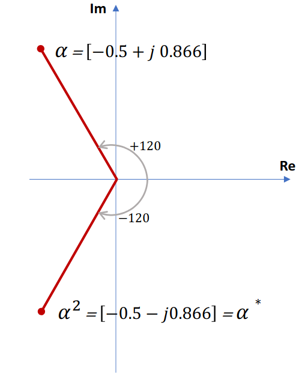

## What Are Symmetrical Components?

Imagine you have a three-phase electrical system that's "unbalanced" - meaning the three phases don't have equal magnitudes or aren't perfectly spaced 120° apart. This makes analysis very complicated!

**Symmetrical components** is a clever mathematical trick that breaks down any unbalanced 3-phase system into three simpler, balanced systems that are much easier to work with.

### The Three Components

Any unbalanced system can be split into exactly three balanced components:

1. **Positive Sequence** ($A_1, B_1, C_1$) - Rotates in the same direction as the original system
2. **Negative Sequence** ($A_2, B_2, C_2$) - Rotates in the opposite direction  
3. **Zero Sequence** ($A_0, B_0, C_0$) - All three phases are identical (same magnitude and phase)

---

## Understanding the Magic Operator $\alpha$

Before we dive deeper, we need to understand a special mathematical tool called the **$\alpha$ operator**.

Think of $\alpha$ as a "rotation tool":
- $\alpha = 1 \angle 120°$ - rotates a phasor by 120° counterclockwise
- $\alpha^2 = 1 \angle 240°$ - rotates a phasor by 240° counterclockwise
- $\alpha^3 = 1 \angle 360° = 1 \angle 0°$ - back to the original position

In rectangular form:
- $\alpha = -0.5 + j0.866$
- $\alpha^2 = -0.5 - j0.866$

**Key property:** $1 + \alpha + \alpha^2 = 0$ (this will be useful later!)

---

## The Transformation Equations

Here's where the magic happens. For any unbalanced system with phases A, B, and C:

### Forward Transformation (Unbalanced → Symmetrical Components)

$$\begin{bmatrix} A_0 \\ A_1 \\ A_2 \end{bmatrix} = \frac{1}{3} \begin{bmatrix} 1 & 1 & 1 \\ 1 & \alpha & \alpha^2 \\ 1 & \alpha^2 & \alpha \end{bmatrix} \begin{bmatrix} A \\ B \\ C \end{bmatrix}$$

**In simple terms:**
- $A_0 = \frac{1}{3}(A + B + C)$ - Zero sequence is just the average
- $A_1 = \frac{1}{3}(A + \alpha B + \alpha^2 C)$ - Positive sequence
- $A_2 = \frac{1}{3}(A + \alpha^2 B + \alpha C)$ - Negative sequence

### Inverse Transformation (Symmetrical Components → Unbalanced)

$$\begin{bmatrix} A \\ B \\ C \end{bmatrix} = \begin{bmatrix} 1 & 1 & 1 \\ 1 & \alpha^2 & \alpha \\ 1 & \alpha & \alpha^2 \end{bmatrix} \begin{bmatrix} A_0 \\ A_1 \\ A_2 \end{bmatrix}$$

**In simple terms:**
- $A = A_0 + A_1 + A_2$
- $B = A_0 + \alpha^2 A_1 + \alpha A_2$  
- $C = A_0 + \alpha A_1 + \alpha^2 A_2$

---

## Worked Example 1: Finding Symmetrical Components

**Problem:** A 3-phase generator has unbalanced voltages:
- $V_a = 230 \angle 0°$ V
- $V_b = 230 \angle -90°$ V  
- $V_c = 230 \angle 100°$ V

**Find the symmetrical components.**

**Solution:**
Using the forward transformation:

$$\begin{bmatrix} V_0 \\ V_1 \\ V_2 \end{bmatrix} = \frac{1}{3} \begin{bmatrix} 1 & 1 & 1 \\ 1 & \alpha & \alpha^2 \\ 1 & \alpha^2 & \alpha \end{bmatrix} \begin{bmatrix} 230 \angle 0° \\ 230 \angle -90° \\ 230 \angle 100° \end{bmatrix}$$

**Step-by-step calculation:**

1. **Zero sequence:** $V_0 = \frac{1}{3}(230 \angle 0° + 230 \angle -90° + 230 \angle 100°)$
2. **Positive sequence:** $V_1 = \frac{1}{3}(230 \angle 0° + \alpha \cdot 230 \angle -90° + \alpha^2 \cdot 230 \angle 100°)$
3. **Negative sequence:** $V_2 = \frac{1}{3}(230 \angle 0° + \alpha^2 \cdot 230 \angle -90° + \alpha \cdot 230 \angle 100°)$

**Final Answer:**
- $V_0 = 63.4 \angle -1.0°$ V
- $V_1 = 215.4 \angle 3.2°$ V  
- $V_2 = 49.7 \angle -167.3°$ V

---

## Worked Example 2: A More Balanced System

**Problem:** Another 3-phase generator has:
- $V_a = 200 \angle 0°$ V
- $V_b = 220 \angle -120°$ V
- $V_c = 240 \angle 120°$ V

**Solution:**
Notice that this system is "almost" balanced - the phase angles are exactly 120° apart, but the magnitudes are different.

Using the same transformation:

**Answer:**
- $V_0 = 11.5 \angle 150°$ V (small zero sequence)
- $V_1 = 220.0 \angle 0°$ V (large positive sequence - this is the "main" component)
- $V_2 = 11.5 \angle -150°$ V (small negative sequence)

**Key Insight:** Since this system is nearly balanced, most of the energy is in the positive sequence component!

---

## Worked Example 3: Reverse Calculation

**Problem:** You're given symmetrical components of currents:
- $I_0 = 0 \angle 0°$ A (no zero sequence)
- $I_1 = 2.0 \angle 0°$ A
- $I_2 = 1.0 \angle 90°$ A

**Find the actual phase currents.**

**Solution:**
Using the inverse transformation:

$$\begin{bmatrix} I_A \\ I_B \\ I_C \end{bmatrix} = \begin{bmatrix} 1 & 1 & 1 \\ 1 & \alpha^2 & \alpha \\ 1 & \alpha & \alpha^2 \end{bmatrix} \begin{bmatrix} 0 \\ 2.0 \angle 0° \\ 1.0 \angle 90° \end{bmatrix}$$

**Step-by-step:**
- $I_A = 0 + 2.0 \angle 0° + 1.0 \angle 90°$
- $I_B = 0 + \alpha^2 \cdot 2.0 \angle 0° + \alpha \cdot 1.0 \angle 90°$
- $I_C = 0 + \alpha \cdot 2.0 \angle 0° + \alpha^2 \cdot 1.0 \angle 90°$

**Final Answer:**
- $I_A = 2.2 \angle 26.6°$ A
- $I_B = 2.9 \angle -129.9°$ A
- $I_C = 1.2 \angle 96.2°$ A

---

## Power Calculation with Symmetrical Components

Here's a beautiful property: **the total power can be calculated using just the symmetrical components!**

For total complex power:
$$S = 3 \cdot V_{A,0} \cdot I^*_{A,0} + 3 \cdot V_{A,1} \cdot I^*_{A,1} + 3 \cdot V_{A,2} \cdot I^*_{A,2}$$

Or in matrix form:
$$S = 3 \cdot [V_{A,0} \quad V_{A,1} \quad V_{A,2}] \cdot \begin{bmatrix} I^*_{A,0} \\ I^*_{A,1} \\ I^*_{A,2} \end{bmatrix}$$

**Why is this useful?** You can calculate the total power without converting back to phase quantities!

---

## Impedances and Symmetrical Components

Here's where things get really interesting for power system analysis:

### For Simple Loads (No Mutual Coupling)
Each symmetrical component sees the **same impedance**. This means:
- Apply each voltage component separately to the load
- Calculate the corresponding current components
- Convert back to phase currents using the inverse transformation

### For Complex Systems (Transmission Lines, Machines)
The impedances are **different** for each sequence:
- **Positive sequence impedance** ($Z_1$) - for normal operation
- **Negative sequence impedance** ($Z_2$) - for reverse rotation effects  
- **Zero sequence impedance** ($Z_0$) - for ground current paths

**Key Point:** This is why symmetrical components are so powerful for analyzing faults in power systems - each type of fault creates different combinations of sequence components!